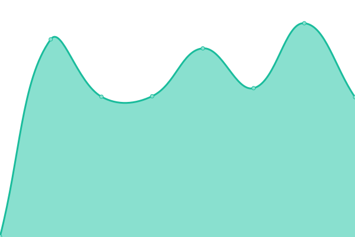
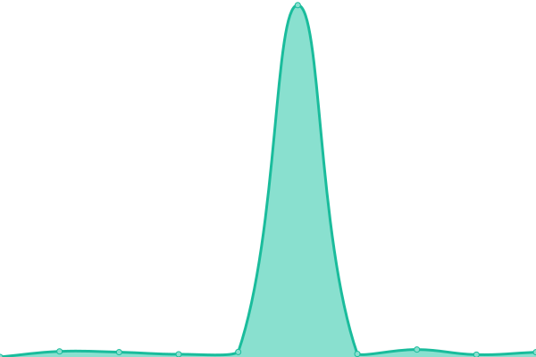

# [📈 Live Status](https://EllieBotDevs.github.io/Ellie-status): <!--live status--> **🟩 All systems operational**

This repository contains the open-source uptime monitor and status page for [EllieBot Devs](https://elliebot.emotionchild.com), powered by [Upptime](https://github.com/upptime/upptime).

With [Upptime](https://upptime.js.org), you can get your own unlimited and free uptime monitor and status page, powered entirely by a GitHub repository. We use [Issues](https://github.com/EllieBotDevs/Ellie-status/issues) as incident reports, [Actions](https://github.com/EllieBotDevs/Ellie-status/actions) as uptime monitors, and [Pages](https://EllieBotDevs.github.io/Ellie-status) for the status page.

<!--start: status pages-->
<!-- This summary is generated by Upptime (https://github.com/upptime/upptime) -->
<!-- Do not edit this manually, your changes will be overwritten -->
<!-- prettier-ignore -->
| URL | Status | History | Response Time | Uptime |
| --- | ------ | ------- | ------------- | ------ |
|  [Ellie Bot Website](https://elliebot.emotionchild.com) | 🟩 Up | [ellie-bot-website.yml](https://github.com/EllieBotDevs/Ellie-status/commits/HEAD/history/ellie-bot-website.yml) | 

 414ms
     
 | 

<a href="https://EllieBotDevs.github.io/Ellie-status/history/ellie-bot-website">100.00%</a>
    

|  [Ellie Bot Devs Site](https://elliebotdevs.emotionchild.com) | 🟩 Up | [ellie-bot-devs-site.yml](https://github.com/EllieBotDevs/Ellie-status/commits/HEAD/history/ellie-bot-devs-site.yml) | 

 338ms
     
 | 

<a href="https://EllieBotDevs.github.io/Ellie-status/history/ellie-bot-devs-site">100.00%</a>
    

|  [Ellie Status Page](https://status.emotionchild.com) | 🟩 Up | [ellie-status-page.yml](https://github.com/EllieBotDevs/Ellie-status/commits/HEAD/history/ellie-status-page.yml) | 

 249ms
     
 | 

<a href="https://EllieBotDevs.github.io/Ellie-status/history/ellie-status-page">99.63%</a>
    

<!--end: status pages-->

[**Visit our status website →**](https://EllieBotDevs.github.io/Ellie-status)

## 📄 License

- Powered by: [Upptime](https://github.com/upptime/upptime)
- Code: [MIT](./LICENSE) © [EllieBot Devs](https://elliebot.emotionchild.com)
- Data in the `./history` directory: [Open Database License](https://opendatacommons.org/licenses/odbl/1-0/)
