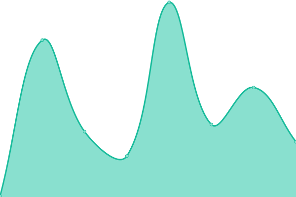
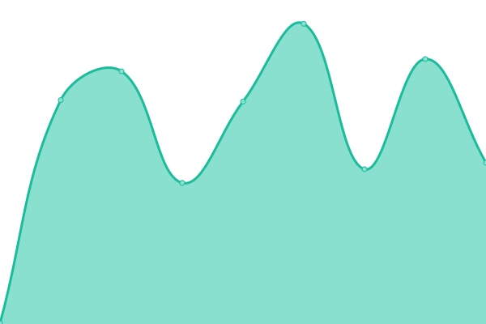
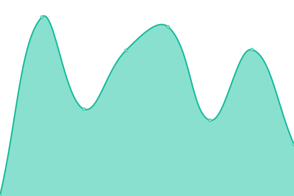
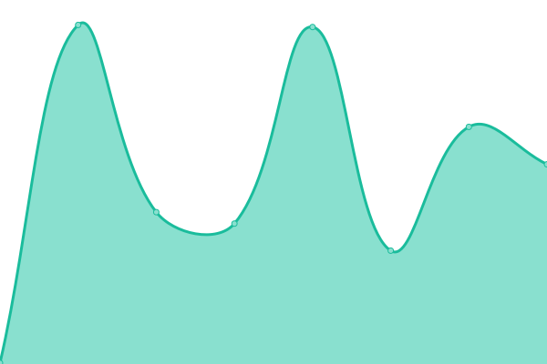

# [📈 Live Status](https://status.elliebot.net): <!--live status--> **🟩 All systems operational**

This repository contains the open-source uptime monitor and status page for [EllieBot Devs](https://www.elliebot.net), powered by [Upptime](https://github.com/upptime/upptime).

With [Upptime](https://upptime.js.org), you can get your own unlimited and free uptime monitor and status page, powered entirely by a GitHub repository. We use [Issues](https://github.com/EllieBotDevs/Ellie-status/issues) as incident reports, [Actions](https://github.com/EllieBotDevs/Ellie-status/actions) as uptime monitors, and [Pages](https://www.elliebot.net) for the status page.

<!--start: status pages-->
<!-- This summary is generated by Upptime (https://github.com/upptime/upptime) -->
<!-- Do not edit this manually, your changes will be overwritten -->
<!-- prettier-ignore -->
| URL | Status | History | Response Time | Uptime |
| --- | ------ | ------- | ------------- | ------ |
|  [EllieBotDevs site](https://devs.elliebot.net) | 🟩 Up | [ellie-bot-devs-site.yml](https://github.com/EllieBotDevs/Ellie-status/commits/HEAD/history/ellie-bot-devs-site.yml) | 

 307ms
     
 | 

<a href="https://status.elliebot.net/history/ellie-bot-devs-site">99.21%</a>
    

|  [Ellie Command site](https://commands.elliebot.net) | 🟩 Up | [ellie-command-site.yml](https://github.com/EllieBotDevs/Ellie-status/commits/HEAD/history/ellie-command-site.yml) | 

 334ms
     
 | 

<a href="https://status.elliebot.net/history/ellie-command-site">99.21%</a>
    

|  [Status site](https://status.elliebot.net) | 🟩 Up | [status-site.yml](https://github.com/EllieBotDevs/Ellie-status/commits/HEAD/history/status-site.yml) | 

 162ms
     
 | 

<a href="https://status.elliebot.net/history/status-site">99.22%</a>
    

|  [Ellie site](https://www.elliebot.net) | 🟩 Up | [ellie-site.yml](https://github.com/EllieBotDevs/Ellie-status/commits/HEAD/history/ellie-site.yml) | 

 322ms
     
 | 

<a href="https://status.elliebot.net/history/ellie-site">99.22%</a>
    

|  [Ellie Embed Visualizer](https://eb.elliebot.net) | 🟩 Up | [ellie-embed-visualizer.yml](https://github.com/EllieBotDevs/Ellie-status/commits/HEAD/history/ellie-embed-visualizer.yml) | 

 462ms
     
 | 

<a href="https://status.elliebot.net/history/ellie-embed-visualizer">99.23%</a>
    

|  [Ellie Docs](https://docs.elliebot.net) | 🟩 Up | [ellie-docs.yml](https://github.com/EllieBotDevs/Ellie-status/commits/HEAD/history/ellie-docs.yml) | 

 355ms
     
 | 

<a href="https://status.elliebot.net/history/ellie-docs">99.75%</a>
    

<!--end: status pages-->

[**Visit our status website →**](https://status.elliebot.net)

## 📄 License

- Powered by: [Upptime](https://github.com/upptime/upptime)
- Code: [MIT](./LICENSE) © [EllieBot Devs](https://www.elliebot.net)
- Data in the `./history` directory: [Open Database License](https://opendatacommons.org/licenses/odbl/1-0/)
